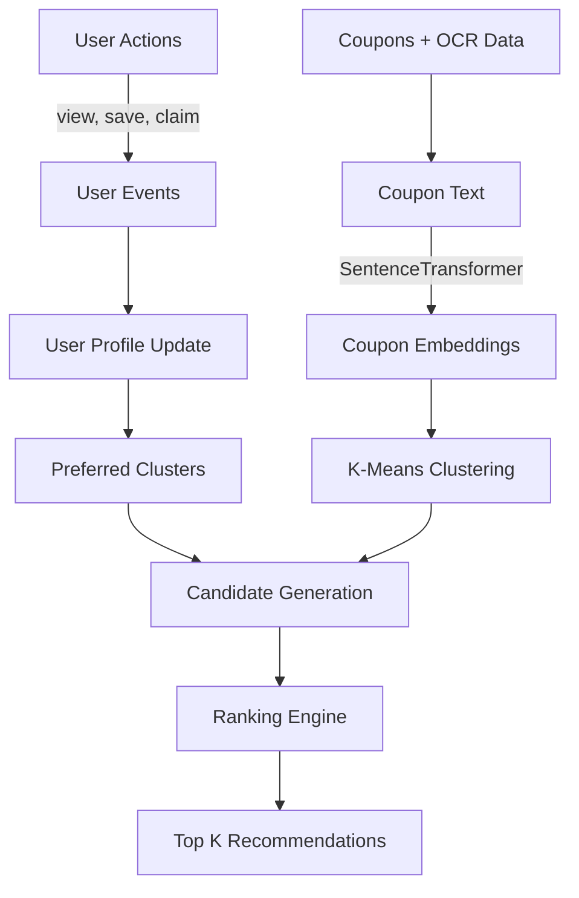

# Vaulto – Smart Coupon Wallet 🎟️

Vaulto is a full-stack coupon-wallet application that helps users digitize, organize, and use coupons smarter. It combines OCR-powered coupon capture via a PaddleOCR microservice, a hybrid recommendation engine, secure multi-method authentication, and a robust Spring Boot backend — all backed by MongoDB, PostgreSQL, and Qdrant.

## Project Purpose

Vaulto is designed to solve common coupon pain points:
- Losing physical coupons
- Missing expiry dates
- Difficulty finding the right coupon at checkout
- No easy way to gift or trade unused deals
- No personalized recommendations for discovering relevant coupons

---

## ✨ Features
- 📸 **OCR coupon digitization** — upload or photograph coupons; PaddleOCR extracts text, and a metadata extractor parses store, discount, category, and expiry
- 🤖 **Hybrid recommendation engine** — K-Means clustering + sentence embeddings for personalized coupon suggestions with cold-start handling
- 🔐 **Multi-auth support**: Email/Password, Google OAuth 2.0, Phone OTP (Twilio)
- 🧾 **Coupon lifecycle management**: add, scan, upload, manual-enter, categorize, search, use, delete
- 📦 **Coupon trading & gifting** — mark coupons tradable and gift them to other users
- ⏰ **Expiring coupon alerts** — automatic expiry notifications with configurable thresholds
- 🔍 **Full-text coupon search** across store names, categories, codes, and descriptions
- 👤 **User profile & preferences** management with avatar and account settings
- 🌙 **Dark mode** and settings customization
- 📱 **Mobile-first responsive UI** with bottom navigation
- 📍 **Proximity-based notifications** for nearby store coupon usage
- ☁️ **One-click AWS deployment** via PowerShell script

---

## 🧰 Technology Stack

### Frontend (`vaulto/`)
| Technology | Purpose |
|---|---|
| **React 19** (Create React App) | UI framework |
| **React Router v7** | Client-side routing |
| **Lucide React** | Icon system |
| **React Webcam** | Camera-based coupon scanning |
| **Vanilla CSS** | Component-scoped stylesheets |

### Backend (`backend/`)
| Technology | Purpose |
|---|---|
| **Java 17** | Language runtime |
| **Spring Boot 4.0** | Application framework |
| **Spring Data MongoDB** | Database access |
| **Spring Security + OAuth2 Client** | Authentication & authorization |
| **JJWT 0.11.5** | JWT generation & validation |
| **Twilio SDK 9.x** | SMS OTP delivery |
| **Lombok** | Boilerplate reduction |
| **Maven** | Build automation |

### Recommendation Service (`recommendation-service/`)
| Technology | Purpose |
|---|---|
| **Python 3.11** + **FastAPI** | API framework |
| **SentenceTransformers** (`all-MiniLM-L6-v2`) | Coupon text embeddings |
| **scikit-learn** (K-Means) | Coupon clustering |
| **Qdrant** | Vector similarity search |
| **PostgreSQL 15** + **SQLAlchemy (async)** | Relational data (events, profiles) |
| **APScheduler** | Background jobs (retraining, trending) |
| **Docker Compose** | Multi-container orchestration |

### PaddleOCR Service (`paddleocr-service/`)
| Technology | Purpose |
|---|---|
| **Python 3.10** + **FastAPI** | API framework |
| **PaddlePaddle + PaddleOCR** | OCR engine with angle classification |
| **Docker** | Containerized deployment |

### Infrastructure
- **MongoDB** — primary database for users and coupons
- **PostgreSQL** — recommendation service relational data
- **Qdrant** — vector database for coupon embeddings
- **AWS Elastic Beanstalk** — backend deployment (Java 17 Corretto)
- **AWS S3** — frontend static hosting

---

## 🗂️ Project Structure

```text
Vaulto/
├── backend/                          # Spring Boot API (Java 17)
│   ├── src/main/java/com/vaulto/
│   │   ├── controller/               # AuthController, CouponController, OcrController
│   │   ├── dto/                      # Request/Response DTOs
│   │   ├── model/                    # User, Coupon MongoDB documents
│   │   ├── repository/               # Spring Data MongoRepositories
│   │   ├── security/                 # SecurityConfig, JWT filter, OAuth2 handler, CookieUtils
│   │   ├── service/                  # Auth, Coupon, OCR, Twilio SMS services
│   │   ├── util/                     # MetadataExtractor (OCR text → coupon fields)
│   │   └── VaultoApplication.java    # Main class (loads .env at startup)
│   ├── src/main/resources/
│   │   └── application.properties
│   ├── .env / .env.example           # Environment credentials
│   ├── pom.xml                       # Maven configuration
│   └── mvnw / mvnw.cmd              # Maven wrappers
│
├── vaulto/                           # React frontend (CRA)
│   ├── src/
│   │   ├── components/               # 28 UI components (Dashboard, ScanCoupon, etc.)
│   │   ├── config/                   # api.js — dynamic API_BASE
│   │   ├── context/                  # SignupContext (multi-step registration)
│   │   ├── styles/                   # Component CSS stylesheets
│   │   ├── assets/                   # Static assets
│   │   ├── utils/                    # Utility functions
│   │   ├── App.jsx                   # Main routing & ExpiryNotifier
│   │   └── main.jsx                  # Vite entry point
│   ├── vite.config.js                # Vite dev server config (port 5173)
│   └── package.json
│
├── recommendation-service/           # Python recommendation engine
│   ├── app/
│   │   ├── api/endpoints.py          # FastAPI routes
│   │   ├── core/                     # Configuration
│   │   ├── db/                       # SQLAlchemy models & database
│   │   ├── services/                 # embedding, clustering, recommendation, user_profile
│   │   ├── tasks/                    # APScheduler background workers
│   │   └── main.py                   # FastAPI app with lifespan events
│   ├── docker-compose.yml            # Spins up API + PostgreSQL + Qdrant
│   ├── Dockerfile
│   └── requirements.txt
│
├── paddleocr-service/                # OCR microservice
│   ├── app.py                        # FastAPI endpoint (/predict)
│   ├── Dockerfile
│   └── requirements.txt
│
├── deploy_aws.ps1                    # Automated AWS deployment script
├── replace_api.cjs                   # Utility to swap localhost URLs for production
└── README.md
```

---

## ⚙️ Setup & Installation

### Prerequisites
- **Java 17** (JDK)
- **Node.js 18+** & npm
- **MongoDB** (running locally or Atlas connection string)
- **Python 3.10+** (for OCR & recommendation services)
- **Docker & Docker Compose** (for recommendation service infrastructure)

### 1) Clone repository
```bash
git clone https://github.com/diMo2004/Vaulto.git
cd Vaulto
git checkout recommendation-system-implemented
```

---

### 2) Backend setup (Spring Boot)
1. Navigate to the backend directory:
   ```bash
   cd backend
   ```
2. Create your `.env` file from the template:
   ```bash
   cp .env.example .env
   ```
3. Update your `.env` variables (see [Environment Variables](#backend-env-configuration) below).
4. Run the Spring Boot backend:
   * **Windows:**
     ```powershell
     .\mvnw spring-boot:run
     ```
   * **macOS / Linux:**
     ```bash
     chmod +x mvnw
     ./mvnw spring-boot:run
     ```
5. Backend starts at `http://localhost:8080`

#### Backend `.env` configuration
```env
PORT=8080
MONGO_URI=mongodb://localhost:27017/coupons_auth

# JWT keys — must be at least 256 bits (32+ characters)
JWT_ACCESS_SECRET=your_super_secure_access_secret_key_32_chars_or_more
JWT_REFRESH_SECRET=your_super_secure_refresh_secret_key_32_chars_or_more
ACCESS_TOKEN_EXPIRES=15m
REFRESH_TOKEN_EXPIRES=30d

# Google OAuth
GOOGLE_CLIENT_ID=your_google_client_id.apps.googleusercontent.com
GOOGLE_CLIENT_SECRET=your_google_client_secret
GOOGLE_CALLBACK_URL=http://localhost:8080/auth/google/callback
GOOGLE_SUCCESS_REDIRECT=http://localhost:3000/dashboard

COOKIE_DOMAIN=localhost
NODE_ENV=development
SESSION_SECRET=your_session_secret

# Phone OTP (Twilio) — optional, required for phone login
TWILIO_ACCOUNT_SID=your_twilio_account_sid
TWILIO_AUTH_TOKEN=your_twilio_auth_token
TWILIO_FROM_NUMBER=+1XXXXXXXXXX
```

---

### 3) Frontend setup (React)
1. Navigate to the frontend directory:
   ```bash
   cd vaulto
   ```
2. Install dependencies:
   ```bash
   npm install
   ```
3. Start the development server:
   ```bash
   npm start
   ```
4. Frontend opens at `http://localhost:3000`

> **Note:** The frontend's `API_BASE` defaults to `http://localhost:8080`. To change it, set the `REACT_APP_API_BASE` environment variable in `vaulto/.env`.

---

### 4) PaddleOCR Service setup
The OCR microservice runs on port `8081` and is called by the Spring Boot backend.

**Option A — Docker (recommended):**
```bash
cd paddleocr-service
docker build -t vaulto-ocr .
docker run -p 8081:8000 vaulto-ocr
```

**Option B — Local Python:**
```bash
cd paddleocr-service
pip install -r requirements.txt
PORT=8081 python app.py
```

---

### 5) Recommendation Service setup (Docker Compose)
This spins up the FastAPI recommendation API, PostgreSQL, and Qdrant together.

```bash
cd recommendation-service
docker compose up --build
```

Services started:
| Service | URL |
|---|---|
| Recommendation API | `http://localhost:8000` |
| PostgreSQL | `localhost:5432` |
| Qdrant | `http://localhost:6333` |

---

## 🚀 Usage Guide
1. **Register** with email/password, Google, or phone OTP.
2. **Scan/upload** coupons — PaddleOCR extracts text and auto-fills metadata.
3. **Manual entry** — add coupons by hand when scanning isn't suitable.
4. **Browse** your dashboard, search by store/category/code.
5. **Trade & gift** — mark coupons as tradable and gift to other users.
6. **Get recommendations** — the hybrid engine suggests relevant coupons.
7. **Expiry alerts** — automatic notifications for coupons expiring soon.

---

## 🔐 Authentication Methods

### 1) Local (Email + Password)
- Register: `POST /auth/register`
- Login: `POST /auth/login`
- Passwords are securely hashed server-side via Spring Security

### 2) Google OAuth 2.0
- Initiate: redirect browser to `http://localhost:8080/oauth2/authorization/google`
- Handled by Spring Security OAuth2 Client with `OAuth2SuccessHandler`
- On success, JWT cookies are set and user is redirected to the frontend

### 3) Phone OTP (Twilio)
- Send OTP: `POST /auth/phone/start`
- Verify OTP: `POST /auth/phone/verify`
- OTPs expire and are validated server-side before JWT cookie issuance

---

## 📡 API Reference

### Auth & User (`/auth`)
| Method | Endpoint | Description |
|---|---|---|
| `POST` | `/auth/register` | Register new user (email + password) |
| `POST` | `/auth/login` | Login with email + password |
| `POST` | `/auth/phone/start` | Send OTP to phone number |
| `POST` | `/auth/phone/verify` | Verify OTP and issue tokens |
| `POST` | `/auth/refresh-token` | Refresh JWT access token |
| `POST` | `/auth/logout` | Clear auth cookies |
| `GET` | `/auth/me` | Get authenticated user profile |
| `PUT` | `/auth/me` | Update user profile |

### Coupons (`/coupons`)
| Method | Endpoint | Description |
|---|---|---|
| `POST` | `/coupons/add` | Add a new coupon |
| `GET` | `/coupons/all` | Get all user's coupons |
| `POST` | `/coupons/{id}/use` | Mark coupon as used |
| `GET` | `/coupons/tradeable` | Get tradeable coupons |
| `POST` | `/coupons/{id}/tradable` | Toggle tradable status |
| `POST` | `/coupons/gift` | Gift a coupon to another user |
| `GET` | `/coupons/expiring-soon?days=3` | Get coupons expiring within N days |
| `DELETE` | `/coupons/{id}` | Delete a coupon |
| `POST` | `/coupons/ocr` | Upload image → OCR text + parsed metadata |

### Recommendations (port `8000`)
| Method | Endpoint | Description |
|---|---|---|
| `GET` | `/recommendations/{user_id}?top_k=10` | Get top-K recommended coupons |
| `POST` | `/events` | Track a user interaction event |
| `POST` | `/coupons` | Add coupon with auto-embedding & clustering |
| `POST` | `/retrain-clusters` | Trigger background K-Means retraining |
| `POST` | `/update-user-profile` | Update user preferred categories |

---

## 🛡️ Security Features
- **JWT-based auth** with short-lived access and long-lived refresh token strategy (HMAC-SHA256, 256-bit+ keys)
- **HttpOnly cookie storage** for JWT tokens (prevents XSS attacks)
- **Spring Security OAuth2 Client** integration for Google federation
- **Secure Twilio SMS OTP** verification for multi-factor login
- **CORS** configured to only allow the frontend origin

---

## 🧠 Hybrid Recommendation System

### Architecture Overview
The recommendation engine employs a multi-layered hybrid approach:



### Recommendation Layers
| Layer | Description |
|---|---|
| **Rule-Based** | Handles cold-start with popular, trending, high-discount, and expiring-soon coupons |
| **Embedding-Based** | Converts coupon text/metadata into dense vectors via `all-MiniLM-L6-v2` |
| **K-Means Clustering** | Groups similar coupons into semantic clusters in Qdrant |
| **User Interest Profiling** | Tracks interactions (views, saves, claims) to build cluster affinity weights |
| **Candidate Ranking** | Merges similarity and rule-based metrics into a weighted final score |

### Ranking Formula
```
final_score =
  0.35 × cluster_affinity +
  0.25 × embedding_similarity +
  0.15 × popularity +
  0.15 × discount +
  0.10 × expiry_urgency
```

| Factor | Description |
|---|---|
| `cluster_affinity` | User's interaction frequency with this coupon's cluster |
| `embedding_similarity` | Cosine similarity to the user's preference vector |
| `popularity` | Global interaction volume |
| `discount` | Normalized discount percentage |
| `expiry_urgency` | Boost for coupons expiring within 3 days |

### Background Jobs (APScheduler)
- **Embedding worker** — generates vectors when new coupons are created
- **Cluster retraining** — refits K-Means daily across all coupon embeddings
- **User profile sync** — aggregates interaction logs into profile weights
- **Trending calculator** — pre-computes global popularity metrics

### Database Schema
| Collection / Table | Description |
|---|---|
| `users` (MongoDB) | User identity, auth credentials, profile fields |
| `coupons` (MongoDB) | Coupon metadata — store, category, discount, code, tags, expiry |
| `coupons` (PostgreSQL) | Recommendation service coupon records with `cluster_id` |
| `user_events` (PostgreSQL) | Interaction tracking — `user_id`, `coupon_id`, `event_type`, `timestamp` |
| `user_profiles` (PostgreSQL) | Personalized weights — `cluster_weights`, `preferred_categories` |
| Qdrant collection | Coupon embedding vectors for similarity search |

---

## ☁️ AWS Deployment (Free Tier)

Vaulto includes an automated PowerShell script for deploying to AWS Free Tier.

### What it deploys:
1. **Backend** → AWS Elastic Beanstalk (Java 17 Corretto, `t2.micro`)
2. **Frontend** → AWS S3 Static Website Bucket

### Steps:
1. Install and configure the **AWS CLI**:
   ```bash
   aws configure
   ```
2. Run the deployment script from the project root:
   ```powershell
   .\deploy_aws.ps1
   ```
3. Follow the post-deployment instructions printed by the script:
   - Add environment variables via the Elastic Beanstalk console
   - Update Google OAuth authorized redirect URIs
   - Add the frontend S3 URL to Google OAuth authorized JavaScript origins

> **Note:** The PaddleOCR and Recommendation services require separate deployment (e.g., AWS ECS, EC2, or a container platform).

---

## 🤝 Contributing
1. Fork the repository.
2. Create a feature branch (`feat/<name>`).
3. Commit focused changes with clear messages.
4. Open a Pull Request with testing notes and screenshots for UI changes.

---

## 📄 License
No `LICENSE` file is currently present. Until one is added, usage and redistribution are not explicitly granted.
Recommended: add a standard license such as `MIT` or `Apache-2.0`.

---

## 🛠️ Makefile

A [Makefile](Makefile) is included at the project root for quick access to all common commands. Run `make help` to see the full list.

### Quick Reference

| Command | Description |
|---|---|
| `make help` | Show all available targets |
| `make install` | Install frontend npm dependencies |
| `make backend` | Run Spring Boot backend (port 8080) |
| `make frontend` | Run React dev server (port 3000) |
| `make ocr-docker` | Build & run PaddleOCR via Docker (port 8081) |
| `make ocr-local` | Run PaddleOCR locally with Python (port 8081) |
| `make recommend-up` | Start recommendation stack — API + PostgreSQL + Qdrant (port 8000) |
| `make recommend-down` | Stop recommendation Docker Compose stack |
| `make recommend-build` | Rebuild recommendation Docker images |
| `make backend-build` | Package backend JAR (skips tests) |
| `make frontend-build` | Build React production bundle |
| `make deploy` | Deploy to AWS via `deploy_aws.ps1` |
| `make clean` | Clean all build artifacts |
| `make stop` | Stop all background Docker services |

### Running the Full Stack
Since each service is a long-running process, run them in **separate terminals**:

```bash
# Terminal 1 – Backend
make backend

# Terminal 2 – Frontend
make frontend

# Terminal 3 – PaddleOCR
make ocr-docker

# Terminal 4 – Recommendation engine
make recommend-up
```

---

## 🗺️ Future Roadmap
- **Collaborative Filtering** — matrix factorization for user-item interaction matrices
- **LightFM integration** — hybrid content + interaction model
- **Neural Collaborative Filtering** — capture complex non-linear user-coupon relationships
- **QR code generation** — in-store redemption flow
- **Push notifications** — real-time expiry and proximity alerts
- **Social features** — coupon sharing feeds and community trading marketplace
