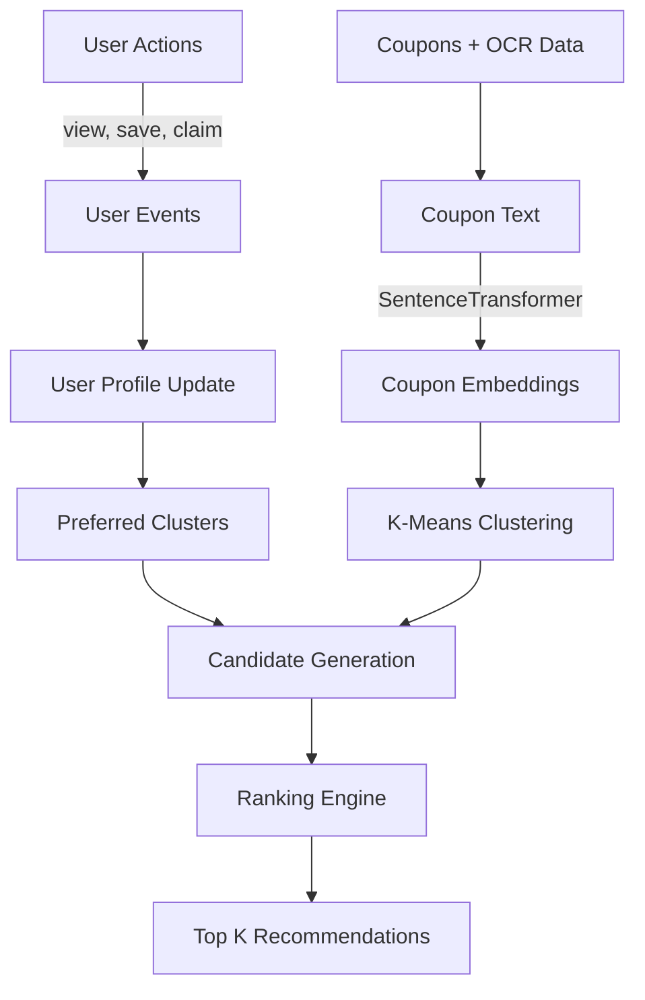

# Vaulto – Smart Coupon Wallet 🎟️

Vaulto is a coupons-wallet application that helps users digitize, organize, and use coupons smarter. It combines OCR-powered coupon capture, personalized recommendations, secure multi-method authentication, and a fully robust Java backend.

## Project Purpose
Vaulto is designed to solve common coupon pain points:
- Losing physical coupons
- Missing expiry dates
- Difficulty finding the right coupon at checkout
- No easy way to gift or trade unused deals

---

## ✨ Features
- 📸 **OCR coupon digitization** for handwritten and printed coupons
- 🤖 **Clustering-based recommendations** for personalized deal discovery
- 🔐 **Multi-auth support**: Email/Password, Google OAuth, Phone OTP
- 🧾 **Coupon lifecycle management**: add, scan, categorize, search, delete
- 🔳 **QR-ready coupon flow** for in-store usage scenarios
- 👤 **User profile & preferences** management
- ⏰ **Expiring coupon alerts** and prioritization
- 🎁 **Coupon gifting/trading** workflows
- 🌙 **Dark mode** and settings customization
- 📱 **Mobile-first responsive UI**

---

## 🧰 Technology Stack

### Frontend
- **React (Create React App)**
- **Tailwind CSS** (styling approach for responsive UI)
- **Lucide React** (icons)
- **Tesseract.js** (OCR)

### Backend
- **Java 17**
- **Spring Boot 3**
- **Spring Data MongoDB**
- **Spring Security (OAuth2 Client & JWT)**
- **Twilio SDK** (SMS integration)
- **Maven** (build automation)

### Authentication & Security
- **JWT access + refresh tokens** (HMAC-SHA256 signature, 256-bit+ secure keys)
- **Google OAuth 2.0** integrated via Spring Security OAuth2 Client
- **Phone OTP with Twilio SMS flow**
- **HttpOnly auth cookies** for secure token storage

---

## 🗂️ Project Structure

```text
Vaulto/
├── backend/
│   ├── src/main/java/com/vaulto/
│   │   ├── config/           # CORS & general beans
│   │   ├── controllers/      # Auth, Coupon REST API endpoints
│   │   ├── models/           # User, Coupon MongoDB documents
│   │   ├── repositories/     # Spring Data MongoRepositories
│   │   ├── security/         # SecurityConfig, JWT filters, Google OAuthSuccessHandler
│   │   ├── services/         # User, Coupon, & Twilio SMS business logic
│   │   └── VaultoApplication.java # Spring Boot main class (reads .env dynamically)
│   ├── src/main/resources/
│   │   └── application.properties # Default configurations & fallback settings
│   ├── .env                  # Environment credentials
│   ├── pom.xml               # Maven configuration
│   └── mvnw / mvnw.cmd       # Maven wrappers
├── vaulto/                   # Frontend app (React CRA)
│   ├── public/
│   └── src/
│       ├── components/       # UI Components
│       ├── config/           # Dynamic API Base config
│       ├── context/          # Global Contexts
│       ├── styles/           # CSS Layouts
│       └── App.jsx           # Main routing & app entrance
└── README.md
```

---

## ⚙️ Setup & Installation

### 1) Clone repository
```bash
git clone https://github.com/diMo2004/Vaulto.git
cd Vaulto
```

### 2) Backend setup
1. Navigate to the backend directory:
   ```bash
   cd backend
   ```
2. Create your `.env` file from the template:
   ```bash
   cp .env.example .env
   ```
3. Update your `.env` variables with your active credentials (see below).

#### Backend `.env` configuration
```env
PORT=8080
MONGO_URI=mongodb://localhost:27017/coupons_auth

# JWT keys must be at least 256 bits (32+ characters) long!
JWT_ACCESS_SECRET=your_super_secure_access_secret_key_32_chars_or_more
JWT_REFRESH_SECRET=your_super_secure_refresh_secret_key_32_chars_or_more
ACCESS_TOKEN_EXPIRES=30m
REFRESH_TOKEN_EXPIRES=30d

# Google OAuth
GOOGLE_CLIENT_ID=your_google_client_id.apps.googleusercontent.com
GOOGLE_CLIENT_SECRET=your_google_client_secret
GOOGLE_SUCCESS_REDIRECT=http://localhost:3000/dashboard

COOKIE_DOMAIN=localhost
NODE_ENV=development
SESSION_SECRET=your_session_secret

# Phone OTP (Twilio)
TWILIO_ACCOUNT_SID=your_twilio_account_sid
TWILIO_AUTH_TOKEN=your_twilio_auth_token
TWILIO_FROM_NUMBER=+1XXXXXXXXXX
```

4. Run the Spring Boot backend:
   * **Windows**:
     ```powershell
     ./mvnw spring-boot:run
     ```
   * **macOS/Linux**:
     ```bash
     chmod +x mvnw
     ./mvnw spring-boot:run
     ```

---

### 3) Frontend setup
1. Navigate to the frontend directory:
   ```bash
   cd ../vaulto
   ```
2. Install npm packages:
   ```bash
   npm install
   ```
3. Run the development server:
   ```bash
   npm run dev
   ```

* Frontend default URL: `http://localhost:3000`

---

## ☁️ AWS Deployment (Free Tier)

Vaulto includes an automated PowerShell script to quickly provision and deploy the application to the AWS Free Tier.

### What it does:
1. **Backend**: Packages the Java app and deploys it to **AWS Elastic Beanstalk** (Java 17, `t2.micro` free tier).
2. **Frontend**: Builds the React production bundle and deploys it to an **AWS S3 Static Website Bucket**.

### Deployment Steps:
1. Ensure the **AWS CLI** is installed on your machine.
2. Authenticate the CLI using your IAM user credentials:
   ```bash
   aws configure
   ```
3. Open a fresh PowerShell window (to ensure AWS CLI is in your PATH).
4. Run the automated deployment script from the project root:
   ```powershell
   .\deploy_aws.ps1
   ```
5. Follow the post-deployment instructions printed by the script (e.g., adding Environment Variables via the Elastic Beanstalk console and updating Google OAuth Authorized URLs).

---

## 🚀 Usage Guide
1. Register with email/password, Google, or phone OTP.
2. Scan/upload/manual-enter coupons.
3. Vaulto extracts metadata via OCR and stores coupons.
4. Browse dashboard/search to find relevant deals.
5. Mark coupons tradable, gift to other users, and monitor expiring coupons.
6. Accessibility fallback: use manual coupon entry whenever OCR/QR workflows are not suitable.

---

## 🔐 Authentication Methods

### 1) Local (Email + Password)
- Register: `POST /auth/register`
- Login: `POST /auth/login`
- Passwords securely hashed server-side

### 2) Google OAuth
- Start: redirect browser to `http://localhost:8080/oauth2/authorization/google`
- Managed through Spring Security OAuth2 Client and secure cookies

### 3) Phone OTP (Twilio)
- Start OTP: `POST /auth/phone/start`
- Verify OTP: `POST /auth/phone/verify`
- OTPs expire and are validated server-side before issuing JWT cookies

---

## 📡 API Endpoints (Key)

### Auth & User
- `POST /auth/register`
- `POST /auth/login`
- `POST /auth/phone/start`
- `POST /auth/phone/verify`
- `POST /auth/refresh-token`
- `POST /auth/logout`
- `GET /auth/me`
- `PUT /auth/me`

### Coupons
- `POST /coupons/add`
- `GET /coupons/all`
- `POST /coupons/:id/use`
- `GET /coupons/tradeable`
- `POST /coupons/gift`
- `POST /coupons/:id/tradable`
- `GET /coupons/expiring-soon?days=5`
- `DELETE /coupons/:id`

---

## 🛡️ Security Features
- JWT-based auth with short-lived access and long-lived refresh token strategy
- HttpOnly cookie storage for secure JWT storage (prevents XSS attacks)
- Seamless Google OAuth federation via Spring Security
- Secure Twilio SMS OTP verification for multi-factor login

---

## 🌿 Making `full-app` the Primary Branch
Repository default branch is a GitHub repository setting. To make `full-app` the new primary branch:

1. Open **Settings → Branches → Default branch** in GitHub.
2. Select **`full-app`** as the default branch.
3. (Optional) Protect `full-app` with branch protection rules.
4. (Optional) Retire old `main` after migration validation.

CLI reference for maintainers:
```bash
git fetch origin
git checkout full-app
git pull origin full-app
```

---

## 🤝 Contributing
1. Fork the repository.
2. Create a feature branch (`feat/<name>`).
3. Commit focused changes with clear messages.
4. Open a Pull Request with testing notes and screenshots for UI updates.

---

## 📄 License
No `LICENSE` file is currently present in the repository at this time. Until one is added, usage and redistribution are not explicitly granted (effectively all rights reserved).  
Recommended next step: add a standard license file such as `MIT` or `Apache-2.0`.

---

## 🧠 Hybrid Recommendation System

### 1. Overview
Vaulto features a Hybrid Recommendation System designed to provide highly personalized coupon suggestions. It works effectively from day one by employing a robust **cold-start strategy** using rule-based metrics, and evolves as user interactions increase to provide cluster-based similarity matches.

### 2. Recommendation Architecture
The recommendation engine consists of multiple layers:
- **Rule-Based Layer**: Handles the cold-start problem by suggesting popular, trending, high-discount, and expiring-soon coupons.
- **Embedding-Based Representation**: Converts coupon text/metadata into dense vector embeddings using `all-MiniLM-L6-v2`.
- **K-Means Cluster-Based Layer**: Groups similar coupons into semantic clusters.
- **User Interest Profiling**: Tracks user interactions (views, saves, claims) to dynamically adjust cluster affinities.
- **Candidate Ranking**: Merges similarity and rule-based metrics into a weighted final score for ranking.
- **Future Collaborative Filtering**: Modular design allowing future integration of matrix factorization or LightFM.

### 3. Recommendation Flow Diagram


### 4. Database Schema
- **users**: Stores core user identity and authentication details.
- **coupons**: Stores coupon metadata (`id`, `store`, `category`, `description`, `discount`, `tags`, `expiry`, `cluster_id`).
- **user_events**: Tracks all interactions (`id`, `user_id`, `coupon_id`, `event_type`, `timestamp`).
- **user_profiles**: Maintains personalized weights (`user_id`, `cluster_weights`, `preferred_categories`).

### 5. API Documentation

#### `GET /recommendations/{user_id}`
Returns a ranked list of top `K` recommended coupons for the user.
- **Parameters**: `top_k` (query, default 10)
- **Response**:
```json
{
  "user_id": 1,
  "recommendations": [
    { "id": 101, "store": "Amazon", "discount": 30.0, "cluster_id": 2 }
  ]
}
```

#### `POST /events`
Tracks a user interaction.
- **Body**: `{ "user_id": 1, "coupon_id": 101, "event_type": "save" }`
- **Response**: `{ "message": "Event tracked successfully" }`

#### `POST /coupons`
Adds a new coupon, generates its embedding, and assigns it to a cluster.
- **Body**: `{ "store": "BestBuy", "category": "Electronics", "description": "Laptops on sale", "discount": 20.0, "tags": "laptop,tech" }`
- **Response**: `{ "message": "Coupon created", "id": 102, "cluster_id": 1 }`

#### `POST /retrain-clusters`
Triggers background K-Means retraining across all coupon embeddings.
- **Response**: `{ "message": "Cluster retraining started in background" }`

#### `POST /update-user-profile`
Manually updates user preferred categories.
- **Body**: `{ "user_id": 1, "categories": ["Electronics", "Food"] }`
- **Response**: `{ "message": "User profile updated" }`

### 6. Embedding Pipeline
- **Coupon text generation**: Concatenates store, category, discount, description, tags, and expiry into a unified text block.
- **Model**: `all-MiniLM-L6-v2` via `SentenceTransformer`.
- **Process**: The unified text is encoded into dense float vectors.
- **Storage & Search**: Vectors are stored in **Qdrant**, enabling high-performance cosine similarity searches.

### 7. Cluster Training
- **K-Means training**: Unsupervised clustering algorithm groups the Qdrant vectors.
- **Cluster assignment**: New coupons are instantly assigned to the nearest centroid.
- **Periodic retraining**: A background job runs daily to readjust clusters as the coupon dataset grows.

### 8. Recommendation Formula
The final ranking is determined by a weighted score:
```
final_score = 
  0.35 * cluster_affinity +
  0.25 * embedding_similarity +
  0.15 * popularity +
  0.15 * discount +
  0.10 * expiry_urgency
```
- **cluster_affinity**: How much the user interacts with this coupon's cluster.
- **embedding_similarity**: Cosine similarity to the user's vector representation.
- **popularity**: Global interaction volume.
- **discount**: Normalized discount percentage.
- **expiry_urgency**: Score boosting coupons expiring within the next 3 days.

### 9. Background Jobs
Managed via **APScheduler**:
- **Embedding generation worker**: Runs asynchronously when a new coupon is created.
- **Cluster retraining worker**: Periodically (e.g., every 24h) refits the K-Means model.
- **User profile update worker**: Periodically syncs heavy interaction logs into aggregated profile weights.
- **Trending coupon calculation worker**: Pre-calculates global popularity metrics.

### 10. Future Roadmap
- Integration of **Collaborative Filtering** models.
- **Matrix Factorization** for user-item interaction sparse matrices.
- Implementing **LightFM** for hybrid representation incorporating both content and interactions.
- Exploring **Neural Collaborative Filtering** to capture complex, non-linear user-coupon relationships.

